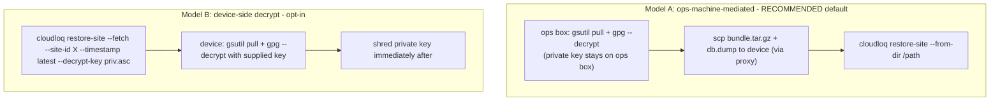
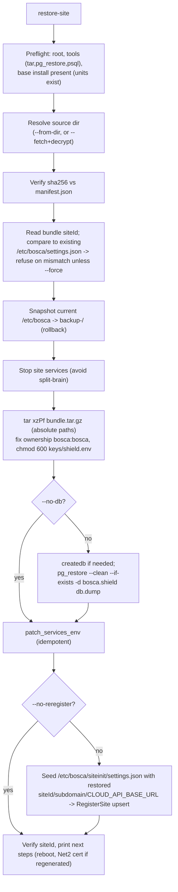

# Site server replacement — design

How to replace the physical **Bosca Shield site server** (dead SD card, failed
appliance, hardware upgrade) **without** orphaning the cloud site, losing Net2
integration, or making encrypted PII/biometrics unrecoverable.

This is the design/architecture reference. The step-by-step operator procedure
lives in
`bosca.shield/docs/Site Server Setup/SERVER_REPLACEMENT_RUNBOOK.md`.

---

## TL;DR

- A site's cloud identity is its **`siteId`** (a GUID). The cloud
  `POST /Site/RegisterSite` endpoint is an **upsert keyed by that GUID** — so a
  replacement that re-registers with the *same* `siteId` keeps every profile,
  event, door, access level, and mapping intact.
- The default provisioning path (`cloudloq_site_init_setup.sh`) runs `uuidgen`
  and mints a **new** `siteId` every time. Using it for a replacement creates a
  **second, empty** cloud site and orphans all existing data. **This is the trap
  to avoid.**
- Continuity therefore reduces to: **give the replacement the old identity
  bundle + database, then re-register (upsert), don't create.**
- Today every site shares **one hardcoded encryption key**, so encrypted PII is
  trivially portable across devices — but that is a security liability we should
  fix on a separate track (see [Encryption keys](#encryption-keys)).

---

## What defines a site (identity anchors)

Investigated in the cloud API and site server. Five *independent* things anchor a
running site:

| Anchor | Lives in | On replacement |
|--------|----------|----------------|
| **`siteId`** (+ `tenantId`, `apiKey`) | `/etc/bosca/settings.json` | **Must be preserved** — cloud primary key |
| **Encryption key + IV** | `/etc/bosca/shield.env` | **Must match the DB** or profile PII + face templates are unreadable |
| **PostgreSQL DB** (`bosca.shield`) | local Postgres | Restore for data + sync watermarks |
| **SSH key + TLS cert/key** | `/home/bosca/{.ssh/id_rsa,cert.pem,key.pem}` | May regenerate — re-register updates the cloud copy |
| **Net2 trust** (site cert on Net2 box, OAuth client + user/pw) | Net2 Windows machine + `settings.json` | Reinstall cert if regenerated; creds unchanged |

Things that are **not** siteId-bound and self-heal:

- **Suprema devices** are keyed by hardware `DeviceId` (uint), rediscovered by
  the gateway scan on startup. New local DB GUIDs are minted on discovery — which
  is why the **DB restore matters for sync-watermark continuity** (the sync sagas
  correlate on the local device GUID).
- **FRP/proxy subdomain** only affects remote access (SSH + cloud→site
  commands), not Net2 LAN traffic. Keeping the same `subdomain` keeps proxy URLs
  stable.

### Where this comes from in code

- Cloud upsert-by-siteId: `bosca.shield.cloud` →
  `Controllers/SiteController.cs` `RegisterSite` (loads `AccountSite` by
  `model.Id`, updates if found else creates).
- Everything scoped to `SiteId` in the tenant DB: `Profile`, `AccessLevel`,
  `Door`, `DoorGroup`, `Event`, `ProfileActivity`, `ProfileStateTracking`,
  face-scanner tracking, `ProfileAuditLog`, `AccountSiteNotificationSettings`,
  Skillko `SkillkoProfileSiteInduction`, `ProcoreSiteMapping`. (Full list: the
  `ClearSiteDataCommandHandler` delete set.)
- Site→cloud auth: `SiteKeyAccessActionFilter` — `ApiKey` header + `siteId` in
  route + `X-TenantId` header. Not cert-based.
- Site identity on the box: `ConfigurationProvider.ServerSiteId` /
  `EventLoggerServerSiteId` / `TenantId`, all reading `/etc/bosca/settings.json`.

---

## The two scenarios

### A. Planned replacement (old device reachable)

Best case. We can pull a fresh, consistent bundle + DB dump from the old box at
swap time, so continuity is full and we don't depend on the backup regimen being
current.

### B. Disaster replacement (old device dead)

We can only restore from whatever off-device backup exists. **This is the
scenario that fails today** because there is no routine off-device backup of the
identity bundle or DB. Everything below in [Backup regimen](#layer-1--backup-regimen)
exists to make scenario B survivable.

---

## What breaks if we get it wrong

Using the default `uuidgen` provisioning for a replacement:

- Cloud creates a **new `AccountSite`** row. Old site still shows in the UI
  (Online/Offline off the stale URL). All historical data stays on the old
  `siteId` and is invisible to the new one.
- Two `AccountSite` rows can share a `subdomain` (no uniqueness constraint) →
  ambiguous FRP routing.
- Cloud→site door/profile mappings (`DoorControllerProfileId`, `DeviceId`) still
  point at the old site; the new site starts empty and rebuilds conflicting
  state.
- `RegisterSite` does **not** re-verify `AccountId` on update, and does not
  cascade-delete — orphans are left behind (`RemoveSite` deletes the record but
  not the data; `ClearSiteData` deletes data but not the record).

Losing the DB without a restore:

- Sync watermarks (`NSB_SupremaEventSyncSaga.LastSyncedEventId`,
  `NSB_Net2EventsSyncSaga.LastSyncedEventTime`) reset → risk of **duplicate
  events pushed to cloud** or gaps. (There was a real duplicate-events incident;
  the auto-reset-to-0 behavior was deliberately removed in v2.0.11.)

Losing/altering the encryption key (once per-site keys exist):

- Profile `FirstName`/`LastName` and face-template blobs become unreadable. No
  recovery without the original key (or a `KeyRotationTool` migration using
  both).

---

## Encryption keys

**Current reality (audited):** there is **no per-site key generation anywhere**.
The same key is hardcoded in every path:

- `ConfigurationProvider.cs` default fallback
- `migrate-to-env-config.sh` (hardcoded, labeled "preserved")
- `quick-fix-production.sh` and `ops-scripts/cloudloq.sh` (written at install)
- committed to the repo at `bosca.shield/src/Bosca.Shield.Data/keys/key.txt`

Consequences:

1. **For replacement:** PII continuity is currently *free* — the key is a known
   global constant, so any device can decrypt any site's DB. The backup regimen
   still captures `shield.env` for correctness/forward-compat, but key loss is
   not a data-loss risk **today**.
2. **Security liability:** one repo-committed key protects biometric templates
   for every site. This should move to **per-site keys** (generated at
   provisioning, stored only in `shield.env` + the backup vault) on a separate
   track. The moment we do that, the backup regimen becomes the *only* thing
   standing between a dead device and unrecoverable PII — so **ship the backup
   regimen before per-site keys**.

`KeyRotationTool` (`bosca.shield/tools/KeyRotationTool/`) already exists to
re-encrypt `Profile` + `ProfileFaceDataBlob` between keys, which is the migration
primitive for moving a site onto its own key.

---

## Proposed solution (layered)

### Layer 1 — Backup regimen (IMPLEMENTED)

Goal: make scenario B survivable. A scheduled job on each site server that
snapshots the **identity bundle** + a **DB dump** off-device.

> **Status:** implemented as `cloudloq backup-site` in `ops-scripts/cloudloq.sh`
> plus `ops-scripts/site/cloudloq-backup.{service,timer}` (daily). Runs once
> automatically after `register-site` / `patch-env`, and is installed by
> `install-server`. Ops setup (bucket, IAM, lifecycle, keypair) is documented in
> `ops-scripts/site/README-backup.md`.

**Bundle contents (small, changes rarely):**

- `/etc/bosca/settings.json` (siteId, tenantId, apiKey, Net2 config, subdomain)
- `/etc/bosca/shield.env` (DB connection + **encryption key/IV**)
- `/etc/bosca/gcp-credentials.json`
- `/home/bosca/.ssh/id_rsa` (+ `.pub`)
- `/home/bosca/cert.pem`, `/home/bosca/key.pem`
- `/etc/bosca/register.json` (last registration inputs, incl. Net2 creds)
- `/etc/bosca/frpc.ini`, `/etc/bosca/frpcssh.ini`
- `/etc/bosca/version.json`

**Database:** `pg_dump -Fc` of `bosca.shield` (includes app tables **and** the
`NSB_*` saga/outbox tables that hold sync watermarks).

**Destination (implemented):** GCS via `gsutil`, authed with the GCP service
account already on the box (`gcp-credentials.json` / project
`cairn-integration`). Layout:
`gs://<bucket>/site-backups/<siteId>/<timestamp>/{bundle.tar.gz.gpg,db.dump.gpg,manifest.json}`,
plus a `.../<siteId>/latest.json` marker. Bucket is `cloudloq-site-backups`,
overridable via `CLOUDLOQ_BACKUP_BUCKET`.

**Protection (implemented):** the bundle contains secrets, so each artifact is
**GPG-encrypted client-side to an ops-held recipient public key** before upload.
The device holds only the public key (`ops-scripts/site/backup-recipient.pub.asc`);
only the ops private key (in the secret vault) can restore. Bucket IAM + optional
CMEK are complementary. `manifest.json` records sha256 for integrity.

**Cadence (implemented):** daily via `cloudloq-backup.timer`
(`OnCalendar=02:30`, `Persistent=true`, randomized delay to spread fleet load),
plus an immediate run after `register-site` / `patch-env`. Retention is enforced
by a **GCS object-lifecycle policy** on the bucket (e.g. delete > 30 days), not
on the device.

### Layer 2 — "Replace, don't create" provisioning path (`cloudloq restore-site`)

A dedicated restore command so operators never accidentally mint a new siteId for
a replacement. It consumes the Layer 1 artifacts and brings a replacement device
back as the **same** site (same `siteId`, upsert re-register) with data +
sync-watermark continuity. The manual runbook remains the fallback when tooling
isn't available.

#### Design tension: where decryption happens

Layer 1 encrypts each artifact to the **ops-held** recipient key; the device
deliberately holds no private key. So restore has two models:



Default: the command operates on a **local directory of already-decrypted
artifacts** (`--from-dir`), keeping the private key off the device. `--fetch` /
`--decrypt-key` is an opt-in convenience for disaster cases.

#### Proposed CLI

```
cloudloq restore-site --from-dir <dir> [options]
cloudloq restore-site --fetch --site-id <guid> [--timestamp latest|<ts>] --decrypt-key <priv.asc> [options]

Options:
  --no-db            Restore identity bundle only (skip pg_restore)
  --no-reregister    Skip the cloud RegisterSite upsert
  --force            Proceed even if an existing settings.json has a different siteId
  --dry-run          Print planned actions, change nothing
```

#### Flow



#### Key decisions

- **Never mints a new siteId.** It reuses the restored `settings.json` siteId;
  re-registration is the existing upsert path (`cloudloq_site_register.sh` reads
  siteId from the seeded `/etc/bosca/siteinit/settings.json` template). This is
  the whole point of Layer 2.
- **Guardrail:** if `/etc/bosca/settings.json` already exists with a *different*
  siteId, refuse unless `--force` — prevents restoring the wrong site onto a live
  box.
- **Rollback safety:** snapshot current `/etc/bosca` to `backup-<ts>/` before
  overwriting, mirroring `migrate-to-env-config.sh`'s backup convention.
- **Integrity:** verify `sha256` against `manifest.json` before applying (reuses
  the sums Layer 1 wrote).
- **Ownership/perms:** the `-P` tar restores absolute paths; explicitly re-apply
  `bosca:bosca` on `/home/bosca/*` and `chmod 600` on `shield.env` + private keys.
- **DB:** `pg_restore --clean --if-exists` into a fresh `bosca.shield`; the dump
  carries `NSB_*` saga watermarks so sync resumes without duplicate-event pushes.
- **Certs stay manual:** prefer restoring the **old** `cert.pem`/`key.pem` so the
  Net2 box's trusted cert keeps working untouched. If regenerated, the Net2 cert
  must be reinstalled — the script prints the reminder; it does not touch the Net2
  box (runbook covers it).
- **Idempotent:** safe to re-run; `--dry-run` for rehearsal.

#### New code (in `cloudloq.sh` + reuse)

- `restore_site()` + helpers (`_restore_verify_manifest`, ownership fixup),
  dispatch entry `restore-site)`, usage line.
- Reuses `_backup_read_json_field`, `patch_services_env`, `register_site`
  seeding, and the `${BACKUP_BUCKET}` / recipient config from Layer 1.
- Optional `--fetch` path reuses `gcloud`/`gsutil` auth + `gpg` (with
  `--decrypt-key`, shredded after use).

### Layer 3 — Cloud guardrails (defense in depth)

> **Status:** the two `RegisterSite` guardrails are implemented in
> `bosca.shield.cloud/src/Bosca.Shield.Cloud.Server/Controllers/SiteController.cs`.

- On `RegisterSite`, if the incoming `subdomain` already maps to a **different**
  `siteId`, a `LogWarning` is emitted (soft — still returns 200) — catches the
  accidental-new-site case in logs/monitoring without breaking a genuine
  subdomain change.
- On update, existing `site.AccountId == apiKey`'s account is now verified before
  overwriting; a mismatch returns `403` (previously unchecked).
- Expose site "last backup at" so ops can see which sites are unprotected.
  Device-side is done (`cloudloq status` reads `/etc/bosca/last-backup.json` and
  flags backups older than `BACKUP_STALE_DAYS`); a cloud-side/fleet view remains.

---

## Phased plan

1. **Ship Layer 1 (backup regimen).** [DONE] Highest leverage; makes disaster
   replacement possible at all. Independent of everything else.
2. **Write/validate the manual runbook** (Layer 2 manual path) [DONE] and dry-run
   it on a spare device using a real backup [pending real-device rehearsal].
3. **Automate Layer 2** (`cloudloq restore-site`). [DONE]
4. **Add Layer 3 guardrails** in the cloud. [DONE]
5. **Separate track:** migrate to per-site encryption keys (needs Layer 1 live
   first), using `KeyRotationTool`. [not started]

Remaining before production use: apply the one-time GCP setup (bucket + IAM +
lifecycle), generate + commit the backup recipient public key, and rehearse a
real restore on a spare device. (New installs get `gcloud` automatically via
`cloudloq_site_init_setup.sh`; only already-deployed devices need it added.)

---

## Open decisions

Resolved for Layer 1:

- **GCS bucket + IAM + at-rest encryption** — bucket `cloudloq-site-backups`
  (env-overridable), SA `roles/storage.objectAdmin`, client-side GPG asymmetric
  encryption to an ops recipient key. See `ops-scripts/site/README-backup.md`.
- **Cadence / retention** — daily timer + post-register/patch hook; retention via
  bucket lifecycle (30 days default).

Still open:

- **Actual bucket provisioning + SA IAM grant + lifecycle policy** must be
  applied once in GCP (documented, not scripted).
- **Ops keypair generation** and committing `backup-recipient.pub.asc`.
- **Restore-time siteId source of truth:** the pulled backup vs. an ops registry
  of `siteId ↔ customer/site`. (Recommend a small registry so scenario B doesn't
  depend on remembering GUIDs.)
- **Cert strategy on replacement:** restore old cert (no Net2 touch) vs. always
  regenerate (requires Net2 reinstall). Recommend restore-old-by-default.
- **Per-site key rollout** timing (separate track, after Layer 1).

---

## Related docs

- Provisioning/activation model: `siteinit/docs/SITE_PROVISIONING.md`
- Operator procedure: `bosca.shield/docs/Site Server Setup/SERVER_REPLACEMENT_RUNBOOK.md`
- Backup setup + usage: `ops-scripts/site/README-backup.md`
- DB backup/restore CLI: `bosca.shield/docs/Site Server Setup/misc/postges-psql-cli.md`
- Real backup example: `bosca.shield/docs/Site Server Setup/misc/Craford-db-backup-20260417.md`
- Net2 controller replacement (different thing): `bosca.shield/docs/Site Server Setup/Net2-Server-Setup/net2-setup.md`
- Key rotation: `bosca.shield/tools/KeyRotationTool/`
