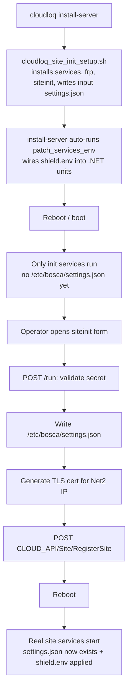

# Site provisioning & activation — reference

How a Bosca/CloudLoq edge **site server** goes from a fresh appliance to a live,
cloud-registered site. This spans three repos; keep them in sync when changing
the provisioning contract.

## Repos involved

| Repo | Role |
|------|------|
| `siteinit` | First-boot web wizard. Collects credentials, writes `/etc/bosca/settings.json`, generates TLS certs, registers with the cloud, reboots. |
| `bosca.shield` | The .NET site services that consume `/etc/bosca/settings.json` (via `ConfigProvider`). Also holds devops installers/migration scripts. |
| `ops-scripts` | Operator tooling (`cloudloq.sh`) — installs/updates the server, patches service env, registers sites. |

## The two `settings.json` files (the key mental model)

There are **two different files**, and confusing them causes real bugs:

| File | Role | Written by | Read by |
|------|------|-----------|---------|
| `/etc/bosca/siteinit/settings.json` | **Input** to the wizard: `secret`, `siteId`, `subdomain`, `CLOUD_API_BASE_URL` | `cloudloq_site_init_setup.sh` | siteinit's `require('./settings.json')` (cwd is `/etc/bosca/siteinit`) |
| `/etc/bosca/settings.json` | **Output** that activates the site | siteinit's `handlers.js` | `bosca.shield` services via `ConfigProvider` |

## Activation mechanism

Activation is driven purely by the **existence of `/etc/bosca/settings.json`**,
enforced by systemd `ConditionPathExists` on the units (set up by
`cloudloq_site_init_setup.sh`):

- Init-phase units run **only while it is absent**:
  `siteinit.service`, `frpcinit.service` → `ConditionPathExists=!/etc/bosca/settings.json`
- Real site units run **only once it exists**:
  `siteapi`, `devicegateway`, `boscamessaging`, `logservernet`, `logserversuprema`,
  `frpc`, `frpcssh` → `ConditionPathExists=/etc/bosca/settings.json`

So the moment siteinit writes `/etc/bosca/settings.json` and reboots, the init
services stop qualifying and the real services start. That write **is** the
activation.

## End-to-end flow



## `settings.json` (output) key reference

Consumed by `bosca.shield/src/Bosca.Shield.Common/ConfigurationProvider.cs`.
Keys are looked up **case-insensitively**; spelling must match. Anything not
present falls back to a hardcoded default in `ConfigProvider`.

**Per-site values** (from the wizard input + form):
`siteId`, `subdomain`, `tenantId`, `CLOUD_API_BASE_URL`, `apiKey`,
`Net2ApiBaseURL`, `Net2ApiHubBaseURL`, `NET2_USER`, `NET2_USER_PW`, `NET2_CLIENT_ID`.

**Site defaults** currently emitted by siteinit (mirrors
`bosca.shield/etc/bosca/settings.json`, the developer reference config):
`Net2LocalTimeOffset`, `GatewayAddress`, `GatewayPort`,
`GatewayCertificateAuthorityFile`, `SupremaHistoricalSyncBatchSize`,
`Net2SyncTimerInMinutes`, `SupremaLogServerMinutes`,
`FaceScannerBackgroundWorkerMinutes`, `Net2EventsSyncSagaRefreshMinutes`,
`Net2EventsSyncSagaProcessorResponseTimeOut`, `SupremaEventsSyncSagaRefreshMinutes`,
`SupremaEventsSyncSagaProcessorResponseTimeOut`, `RollCallEventId`,
`EventsFilterInDays`, `EventsImportMaxRowCount`, `DefaultForceInTime`,
`DefaultForceOutTime`, `UserEnteredZoneTimeout`, `StatusQueueSize`, `CodeMapFile`,
`DemoDevicePort`, `DemoDeviceUseSSL`, `GCPProjectId`, `LogFilePath`,
`LogLabelServiceKey`, `LogLabelServerSiteIdLabel`, `CloudMasterMode`,
`UseServiceControl`, `DefaultEventSyncEnabled`.

**To add a new setting:** add a form field in `siteinit/index.html` (for
operator input) and/or a line to the `config` object in `siteinit/handlers.js`.
The JSON key must match the string `ConfigProvider` passes to `GetSiteSetting(...)`.
A brand-new key also needs a matching property in `ConfigurationProvider.cs`.

### Production vs dev values

`bosca.shield/etc/bosca/settings.json` is the **developer** config (ConfigProvider
points `BOSCA_SETTINGS_PATH` at it). Some values are intentionally dev/prod-tuned:

- `Net2SyncTimerInMinutes = "1"` — **intended for prod** (live-update SLA); ConfigProvider's default is 15.
- `CloudMasterMode`, `UseServiceControl`, various saga timers — confirm intent before copying blindly.

## Secrets are NOT in `settings.json`

Sensitive values come from **environment variables**, loaded via
`/etc/bosca/shield.env` (`EnvironmentFile=` on the .NET units):

- `BOSCA_SHIELD_DB_CONNECTION_STRING`
- `BOSCA_SHIELD_ENCRYPTION_KEY`, `BOSCA_SHIELD_ENCRYPTION_IV`
- `GOOGLE_APPLICATION_CREDENTIALS` → `/etc/bosca/gcp-credentials.json`

`ConfigProvider` reads env var first, then `settings.json`, then a hardcoded
default (fallbacks are marked "TEMPORARY: remove after all sites migrated").

`keycloak.json` and `gcp-credentials.json` are separate files, not part of
`settings.json`.

### shield.env wiring

`cloudloq.sh`'s `patch_services_env` creates `shield.env` + `gcp-credentials.json`
and injects `EnvironmentFile=/etc/bosca/shield.env` into `siteapi`,
`boscamessaging`, `logservernet`, `logserversuprema`.

**As of the latest change, `cloudloq install-server` runs `patch_services_env`
automatically**, so the manual `cloudloq patch-env` step is no longer required
for fresh installs (it remains available for retries / existing sites). This is
safe at install time because the units aren't running yet (their
`ConditionPathExists=/etc/bosca/settings.json` is not satisfied until activation).

## The `NET2_CLIENT_ID` typo — compatibility rule

Historically the settings key was misspelled `NET2_CIENT_ID` (missing "L"), and
that spelling is baked into every already-deployed site's `settings.json`.

Rule going forward:
- **Writers** emit the correct spelling `NET2_CLIENT_ID` (siteinit,
  `install-init-start-shield-site-server.sh`, current setup docs).
- **Readers** accept both, preferring the correct one:
  - `ConfigProvider.Net2ClientId`: env var → `NET2_CLIENT_ID` → `NET2_CIENT_ID` → default
  - `migrate-to-env-config.sh`: `jq '.NET2_CLIENT_ID // .NET2_CIENT_ID // empty'`
- **Dated rollout docs** under `bosca.shield/docs/Site Server Setup/misc/` keep the
  old spelling on purpose — they are historical records of what was deployed.

General principle: because field sites have old keys on disk, **any reader must
keep old keys as a fallback**; only writers may switch outright.

## Build / test notes (bosca.shield)

- Test + Common projects target **`net9.0`**.
- Local toolchain: .NET SDK 10 (Homebrew, arm64). Run `net9` tests via
  major-version roll-forward:

```bash
export DOTNET_ROOT="/opt/homebrew/opt/dotnet/libexec"
export PATH="/opt/homebrew/opt/dotnet/libexec:$PATH"
export DOTNET_ROLL_FORWARD=Major
dotnet test src/Bosca.Shield.UnitTests --filter "FullyQualifiedName~ConfigProviderTests"
```

## Replacing a site server

Hardware swaps have their own failure mode: the default installer mints a **new**
`siteId`, which orphans the existing cloud site and its data. See
`siteinit/docs/SERVER_REPLACEMENT_DESIGN.md` (design) and
`bosca.shield/docs/Site Server Setup/SERVER_REPLACEMENT_RUNBOOK.md` (operator
procedure). The one rule: **reuse the original `siteId` and re-register (upsert),
never create a new one.**

## siteinit implementation notes

- Node built-ins only (`http`/`https`) — the deprecated `request` package was removed.
- `san.cnf` is a pristine template; each run renders `san.generated.cnf` with the
  submitted Net2 IP (never mutate the template in place).
- The provisioning pipeline is sequenced with `async/await` so config + cert
  config are written before `generate-cert.sh` runs.
- `settings.json` (input) is git-ignored — never commit real credentials.
- The setup script clones siteinit from GitHub, so changes only reach new sites
  once pushed.
